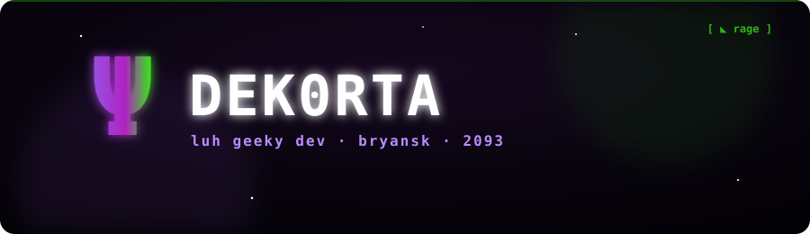

<!-- ═══════════ Ψ DEK0RTA · 2093 ═══════════ -->

<div align="center">



</div>

<br/>

<!-- ░░░░ NOW · live status ░░░░ -->
### `▌ now ▐`

<table>
<tr>
<td valign="top" width="50%">

**◣ on repeat**

<!-- LIVE Spotify — updates by itself once deployed -->
[](https://open.spotify.com/user/PUT_YOUR_SPOTIFY_UID)

</td>
<td valign="top" width="50%">

**◣ coordinates**

```
loc   bryansk, ru
mode  building ai tools
vibe  rage · physics · code
year  2093
```

</td>
</tr>
</table>

<br/>

<!-- ░░░░ TONGUES · languages as a tracklist ░░░░ -->
### `▌ tongues ▐`

<!-- LIVE WakaTime — real coding hours, updates weekly -->
<!--START_SECTION:waka-->
```txt
01 ─ Python       ████████████░░░░░░   bots · gemini · ocr
02 ─ TypeScript   ████████░░░░░░░░░░   next.js · supabase
03 ─ SQL          ███░░░░░░░░░░░░░░░   supabase · data
04 ─ Bash         ██░░░░░░░░░░░░░░░░   deploy · railway
```
<!--END_SECTION:waka-->

<div align="center">


</div>

<br/>

<!-- ░░░░ DROPS · repos as releases ░░░░ -->
### `▌ drops ▐`

| | |
|:--|:--|
| **▸ homework-bot** `Ψ` | telegram bot · gemini llm + ocr. reads homework, drops deadlines into google calendar, runs its own analytics. `python` |
| **▸ coninuum-physics** `Ψ` | physics sims on the web · next.js + supabase — [live ↗](https://coninuum-physics.vercel.app). `typescript` |
| **▸ sportbaza-ironflow** `Ψ` | sport / training tracker. `python` |

<br/>

<!-- ░░░░ STATS ░░░░ -->
### `▌ count ▐`

<div align="center">


</div>

<br/>

<div align="center">
<sub>Ψ &nbsp; <code>// i build tools i use myself</code> &nbsp; Ψ</sub>
</div>
