<!-- ════════ Dek0rta · custom liquid-glass profile ════════ -->

<div align="center">

<!-- HAND-BUILT animated glass banner — feGaussianBlur, moving sheen, aurora refraction -->


</div>

<br/>

<!-- frosted code panel -->
> ```ts
> const dek0rta = {
>   role:    "AI-fullstack developer",
>   place:   "Bryansk, RU 🇷🇺",
>   backend: ["Python", "FastAPI", "Supabase"],
>   ai:      ["Gemini", "OCR", "automation"],
>   web:     ["Next.js", "TypeScript", "Tailwind"],
>   deploy:  ["Vercel", "Railway", "Render"],
>   craft:   "calm · glass · precise",
> };
> ```

<br/>

### &nbsp;◍&nbsp; Stack

<p>


</p>

<br/>

### &nbsp;◍&nbsp; Selected work

| | |
|:--|:--|
| **🧠 Homework-bot** | Telegram-бот: Gemini LLM + OCR. Распознаёт задания, тянет дедлайны в Google Calendar, своя аналитика. `Python` |
| **⚛️ Coninuum-Physics** | Физ-симуляции в вебе. Next.js + Supabase — [живой деплой ↗](https://coninuum-physics.vercel.app). `TypeScript` |
| **💪 SPORTBAZA-IronFlow** | Спорт/трекинг-проект. `Python` |

<br/>

### &nbsp;◍&nbsp; Stats

<div align="center">


</div>

<br/>

<div align="center">
<sub>◍ &nbsp; hand-crafted glass · no templates &nbsp; ◍</sub>
</div>
